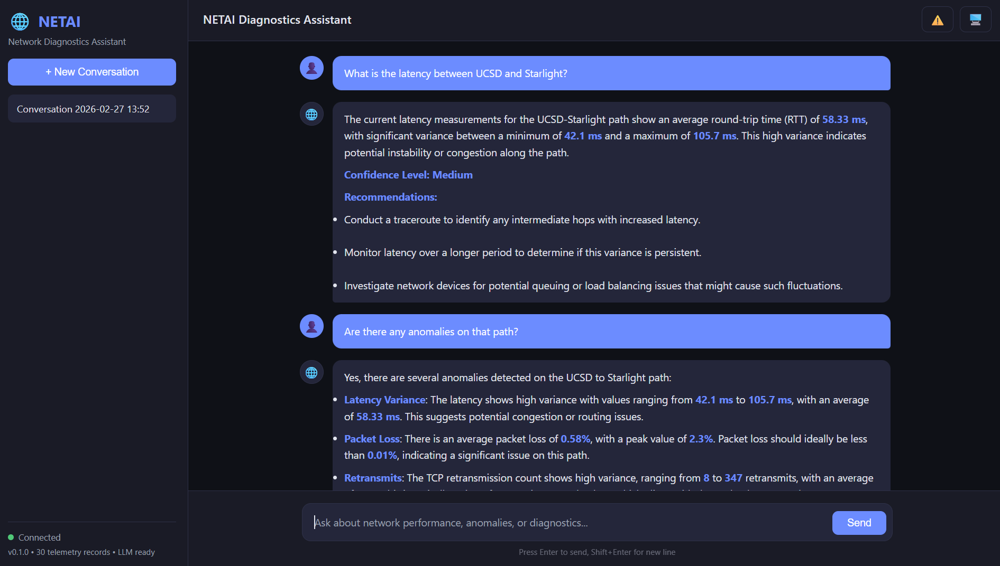
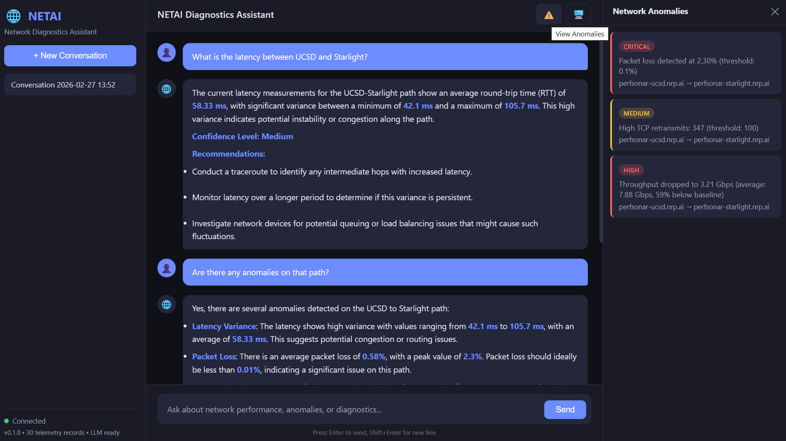
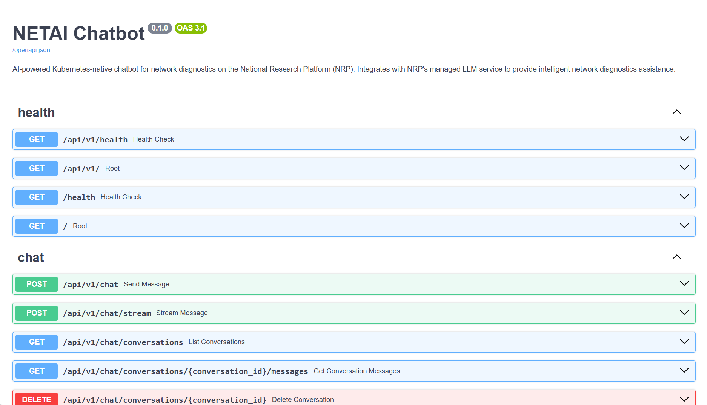
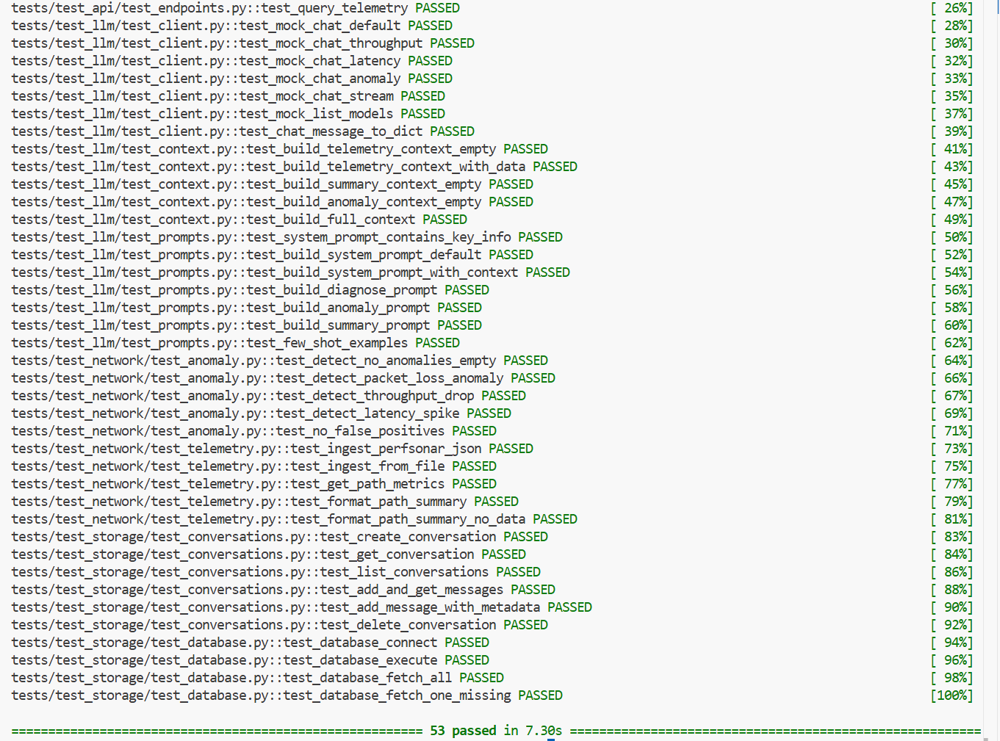
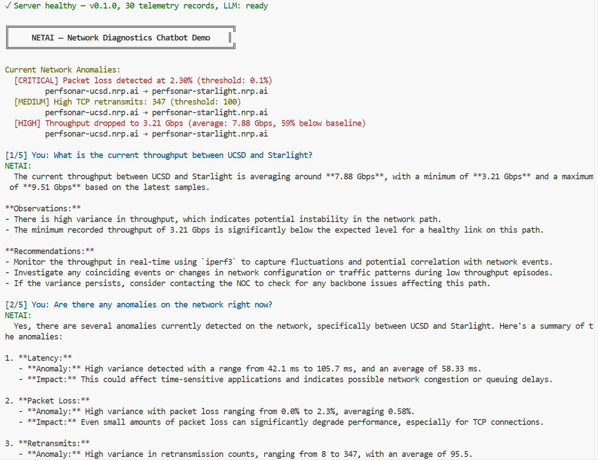

# 🌐 NETAI — AI-Powered Network Diagnostics Chatbot

<div align="center">

**A Kubernetes-native chatbot for intelligent network diagnostics on the National Research Platform**

[](https://python.org)
[](https://fastapi.tiangolo.com)
[](LICENSE)
[](#testing)

</div>

---

## Overview

NETAI is an AI-powered chatbot that integrates with the National Research Platform's (NRP) managed LLM service to provide intelligent network diagnostics assistance. It helps network operators:

- **Analyze** perfSONAR throughput, latency, and packet loss measurements
- **Detect** network anomalies using statistical analysis
- **Explain** complex network behaviors in natural language
- **Suggest** remediation strategies with actionable next steps
- **Visualize** network health through an interactive web interface

### Architecture

```
┌─────────────────────────────────────────────────────────────────┐
│                        Web UI (Chat Interface)                  │
└──────────────────────────┬──────────────────────────────────────┘
                           │ HTTP/SSE
┌──────────────────────────▼──────────────────────────────────────┐
│                    FastAPI Application                          │
│  ┌─────────────┐  ┌─────────────────┐  ┌───────────────────┐    │
│  │  Chat API   │  │ Diagnostics API │  │   Health API      │    │
│  └──────┬──────┘  └────────┬────────┘  └───────────────────┘    │
│         │                  │                                    │
│  ┌──────▼──────────────────▼────────────────────────────────┐   │
│  │              Core Services Layer                         │   │
│  │  ┌─────────────┐  ┌──────────────┐  ┌────────────────┐   │   │
│  │  │  LLM Client │  │   Context    │  │   Anomaly      │   │   │
│  │  │  (OpenAI    │  │   Builder    │  │   Detector     │   │   │
│  │  │   compat.)  │  │    (RAG)     │  │   (Statistical)│   │   │
│  │  └──────┬──────┘  └──────┬───────┘  └────────┬───────┘   │   │
│  │         │                │                   │           │   │
│  │  ┌──────▼────┐   ┌──────▼──────┐   ┌───────▼───────┐     │   │
│  │  │  Prompt   │   │  Telemetry  │   │  Conversation │     │   │
│  │  │  Engine   │   │  Processor  │   │  Store        │     │   │
│  │  └───────────┘   └──────┬──────┘   └───────┬───────┘     │   │
│  └──────────────────────────┼──────────────────┼────────────┘   │
│                             │                  │                │
│  ┌──────────────────────────▼──────────────────▼────────────┐   │
│  │                    SQLite Database                       │   │
│  │  telemetry_records │ conversations │ messages            │   │
│  └──────────────────────────────────────────────────────────┘   │
└─────────────────────────────────────────────────────────────────┘
                           │
              ┌────────────▼────────────┐
              │ NRP Managed LLM Service │
              │  (Qwen3-VL, GLM-4.7,    │
              │   GPT-OSS)              │
              └─────────────────────────┘
```

## Screenshots

<div align="center">

### Chat Interface — AI-Powered Network Diagnostics
<!-- Ask the chatbot about network paths, latency, throughput, etc. -->


### Anomaly Detection — Real-Time Network Monitoring  
<!-- Shows detected anomalies: throughput drops, latency spikes, packet loss -->


### API Documentation — Interactive Swagger UI
<!-- Full REST API with try-it-out functionality -->


### Test Suite — 53 Tests Passing
<!-- Comprehensive tests covering LLM, network, storage, and API layers -->


### Terminal Demo — Guided Feature Walkthrough
<!-- Interactive CLI demo showing anomalies, chat, and path diagnosis -->


</div>

## Features

| Feature | Description |
|---------|-------------|
| **Multi-model LLM Support** | Integrates with NRP's managed LLM service (Qwen3-VL, GLM-4.7, GPT-OSS) via OpenAI-compatible API |
| **Context-Aware Responses** | RAG-style context injection from real-time network telemetry data |
| **Prompt Engineering** | Domain-specific system prompts, few-shot examples, and templates for network diagnostics |
| **Anomaly Detection** | Statistical anomaly detection for throughput drops, latency spikes, and packet loss |
| **perfSONAR Integration** | Ingests and processes perfSONAR measurement data (throughput, latency, loss, traceroutes) |
| **Conversation History** | Persistent multi-turn conversations with full message history |
| **Streaming Responses** | Server-Sent Events (SSE) for real-time streaming chat |
| **RESTful API** | Comprehensive API with OpenAPI/Swagger documentation |
| **Fine-tuning Pipeline** | LoRA-based fine-tuning on network diagnostics data using PEFT |
| **Kubernetes Ready** | Full K8s manifests with GPU pod support, PVCs, and ingress |
| **Web Interface** | Clean, responsive chat UI with anomaly panel and host browser |

## Quick Start

### Prerequisites

- Python 3.10+
- pip

### Installation

```bash
# Clone the repository
git clone https://github.com/anirudh/NETAI-LLM-Integration-Kubernetes-Chatbot.git
cd NETAI-LLM-Integration-Kubernetes-Chatbot

# Create virtual environment
python -m venv .venv
source .venv/bin/activate

# Install with dev dependencies
pip install -e ".[dev]"
```

### Run the Chatbot

```bash
# Option 1: Mock mode (no API key needed — works offline)
make run
# → Open http://localhost:8000/static/index.html

# Option 2: With GPT-4o (real AI responses — recommended for demo)
# Edit .env and set your OpenAI API key, then:
make run-gpt4o
# → Open http://localhost:8000/static/index.html
```

### Quick Demo (terminal)

```bash
# Runs a guided demo showing all features
make demo
```

### Enable GPT-4o

Edit `.env` and set:
```
LLM_API_KEY=sk-your-openai-api-key
LLM_MOCK_MODE=false
```
That's it. The chatbot will now use GPT-4o with full network diagnostics context. The same architecture works with NRP's managed models (Qwen3-VL, GLM-4.7, GPT-OSS) — just change `LLM_API_BASE_URL` and `LLM_MODEL`.

### Run Tests

```bash
python -m pytest tests/ -v
```

### Docker

```bash
# Build and run
docker compose up --build

# Or with live LLM service
LLM_API_KEY=your-key docker compose --profile live up --build
```

### Kubernetes Deployment

```bash
# Apply all manifests
kubectl apply -f k8s/namespace.yaml
kubectl apply -f k8s/configmap.yaml
kubectl apply -f k8s/deployment.yaml
kubectl apply -f k8s/service.yaml
kubectl apply -f k8s/ingress.yaml

# For GPU-enabled inference
kubectl apply -f k8s/gpu-deployment.yaml
```

## API Reference

### Chat Endpoints

| Method | Endpoint | Description |
|--------|----------|-------------|
| `POST` | `/api/v1/chat` | Send a message and receive a response |
| `POST` | `/api/v1/chat/stream` | Stream a response via SSE |
| `GET` | `/api/v1/chat/conversations` | List all conversations |
| `GET` | `/api/v1/chat/conversations/{id}/messages` | Get conversation messages |
| `DELETE` | `/api/v1/chat/conversations/{id}` | Delete a conversation |

### Diagnostics Endpoints

| Method | Endpoint | Description |
|--------|----------|-------------|
| `POST` | `/api/v1/diagnostics/diagnose` | AI-powered path diagnosis |
| `POST` | `/api/v1/diagnostics/telemetry` | Query telemetry records |
| `GET` | `/api/v1/diagnostics/telemetry/summary` | Aggregated telemetry summary |
| `GET` | `/api/v1/diagnostics/telemetry/hosts` | Monitored host pairs |
| `GET` | `/api/v1/diagnostics/anomalies` | Active network anomalies |
| `GET` | `/api/v1/diagnostics/models` | Available LLM models |

### Health

| Method | Endpoint | Description |
|--------|----------|-------------|
| `GET` | `/health` | Service health check |
| `GET` | `/` | Service info |

See full interactive documentation at `/docs` (Swagger) or `/redoc` (ReDoc) when running.

## Fine-Tuning Pipeline

Fine-tune LLMs on network diagnostics data using LoRA (Parameter-Efficient Fine-Tuning):

```bash
# Install fine-tuning dependencies
pip install -e ".[fine-tuning]"

# Prepare training data
python -c "
from netai_chatbot.fine_tuning.data_prep import prepare_training_dataset
prepare_training_dataset('data/sample/fine_tuning_examples.jsonl', 'data/prepared')
"

# Run fine-tuning (requires GPU)
python -m netai_chatbot.fine_tuning.train \
    --base-model Qwen/Qwen2.5-7B-Instruct \
    --data-dir data/prepared \
    --output-dir models/netai-qwen-lora \
    --epochs 3
```

The pipeline supports:
- **4-bit quantization** (BitsAndBytes) for memory-efficient training
- **LoRA adapters** targeting attention and MLP layers
- **Cosine LR schedule** with warmup
- **Automatic train/val split**
- **Synthetic data generation** from telemetry records

## Project Structure

```
├── src/netai_chatbot/
│   ├── main.py                 # FastAPI application entry point
│   ├── config.py               # Configuration management
│   ├── api/
│   │   ├── models.py           # Pydantic request/response schemas
│   │   └── routes/
│   │       ├── chat.py         # Chat endpoints
│   │       ├── diagnostics.py  # Network diagnostics endpoints
│   │       └── health.py       # Health check endpoints
│   ├── llm/
│   │   ├── client.py           # LLM API client (OpenAI-compatible)
│   │   ├── prompts.py          # Prompt engineering templates
│   │   └── context.py          # RAG-style context builder
│   ├── network/
│   │   ├── models.py           # Network data models
│   │   ├── telemetry.py        # Telemetry data processing
│   │   ├── perfsonar.py        # perfSONAR integration
│   │   └── anomaly.py          # Statistical anomaly detection
│   ├── storage/
│   │   ├── database.py         # SQLite database management
│   │   ├── conversations.py    # Conversation history storage
│   │   └── telemetry_store.py  # Telemetry data storage
│   └── fine_tuning/
│       ├── data_prep.py        # Training data preparation
│       └── train.py            # LoRA fine-tuning pipeline
├── static/                     # Web UI (HTML/CSS/JS)
├── k8s/                        # Kubernetes manifests
├── data/sample/                # Sample network telemetry data
├── tests/                      # Comprehensive test suite (53 tests)
├── Dockerfile                  # Multi-stage container build
├── docker-compose.yml          # Local development setup
└── pyproject.toml              # Python project configuration
```

## Technologies

- **Python 3.10+** with async/await throughout
- **FastAPI** for high-performance REST APIs with automatic OpenAPI docs
- **httpx** for async HTTP client (LLM & perfSONAR APIs)
- **SQLite + aiosqlite** for lightweight async storage
- **Pydantic v2** for data validation and serialization
- **PyTorch + PEFT + transformers** for LLM fine-tuning (optional)
- **Docker** for containerization
- **Kubernetes** for orchestration with GPU pod support

## License

Apache License 2.0 — see [LICENSE](LICENSE) for details.

## Acknowledgments

- [National Research Platform (NRP)](https://nrp.ai/) for the managed LLM service and GPU infrastructure
- [perfSONAR](https://www.perfsonar.net/) for the network measurement framework
- Mentors: Dmitry Mishin and Derek Weitzel
